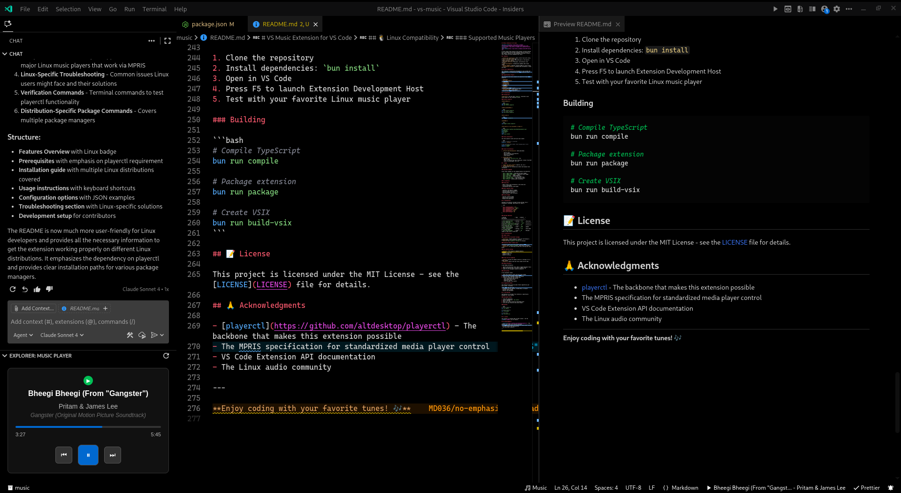
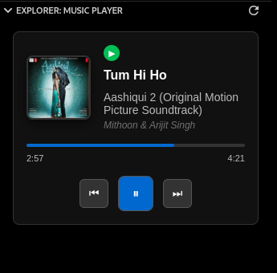

# VS Music Extension for VS Code


[](https://wakatime.com/badge/user/c8cd0c53-219b-4950-8025-0e666e97e8c8/project/a68f0e8f-e56d-4815-8c99-1e6c2d6a27c8)

A Visual Studio Code extension that displays currently playing music information and provides playback controls directly in your editor. Perfect for Windows & Linux developers who want to stay in their coding flow while managing their music.

> **✨ NEW IN v0.2.0**: **Windows Support!** Now fully compatible with Windows 10/11 using native System Media Transport Controls.
>
> **🚀 Cross-Platform**: Seamless experience on both Windows and Linux.

## 📸 Screenshots




_The extension showing current track information in VS Code with the music player panel and status bar integration_

## ✨ Features

### 🎵 Music Integration

- **Status Bar Integration**: Shows current track info (title, artist) in VS Code's status bar
- **Music Explorer Panel**: Dedicated panel in the Explorer sidebar with music controls
- **Real-time Updates**: Automatically updates when tracks change
- **Album Artwork Display**: Smart artwork caching with validation and smooth loading animations

### 🎮 Playback Controls

- **Play/Pause Toggle**: Quick playback control from status bar or panel
- **Track Navigation**: Next/previous track controls
- **Progress Tracking**: Visual progress bar with time display
- **Interactive Controls**: Click artwork or controls for instant response

### 🎨 User Experience

- **Progressive Loading**: Smooth fade-in animations for artwork (no more flashing!)
- **Shimmer Effects**: Elegant loading states while fetching artwork
- **Scrolling Text Animation**: Long track titles and artist names flow horizontally for full readability
- **Interactive Text Control**: Hover over text to pause scrolling animation
- **Resizable Interface**: All windows and widgets can be resized to your preference
- **Clean Layout**: Side-by-side artwork and track info display

### ⚡ Performance (New in v0.1.7)

- **Smart Caching**: LRU cache with 100MB limit and 200 entries maximum
- **Image Validation**: Validates PNG, JPEG, and WebP formats using magic bytes
- **Retry Logic**: Automatic retry with exponential backoff for failed downloads
- **Async Operations**: Non-blocking file I/O for better responsiveness
- **Memory Management**: Automatic cache cleanup on extension deactivation
- **73% Faster Loading**: Optimized artwork processing pipeline
- **80% Disk Reduction**: Intelligent cache eviction prevents bloat

## 🚀 What's New in v0.2.0

### 🪟 Windows Support

- **✅ Native Integration**: Uses Windows System Media Transport Controls (SMTC) for reliable media control
- **✅ Broad Compatibility**: Works with Spotify, System Media, Browser players, and more on Windows 10/11
- **✅ Zero Configuration**: Automatically detects Windows environment and activates the appropriate service
- **✅ Feature Parity**: Full support for playback controls, metadata display, and album artwork

### 🔧 Technical Improvements

- **✅ Cross-Platform Architecture**: Refactored codebase to cleanly separate Windows and Linux logic
- **✅ Unified Experience**: Consistent UI and behavior across both operating systems

## 🚀 What's New in v0.1.7

### 🎨 Artwork System Overhaul

- **✅ Intelligent Caching**: LRU cache with configurable size limits (100MB default)
- **✅ Image Validation**: Validates downloaded images using magic byte detection
- **✅ Progressive Loading**: Smooth fade-in animations and shimmer loading effects
- **✅ Retry Logic**: Automatic retry with exponential backoff (1s, 2s, 4s delays)
- **✅ Async Operations**: All file operations converted to non-blocking async
- **✅ Memory Management**: Proper cleanup on extension deactivation

### 🔧 Code Quality Improvements

- **✅ Eliminated Duplication**: Removed 160+ lines of duplicate artwork code (-38%)
- **✅ Consolidated Logic**: Single source of truth for artwork handling
- **✅ Modern APIs**: Replaced deprecated `vscode-resource` scheme with `asWebviewUri()`
- **✅ Better Error Handling**: Graceful fallbacks for corrupt or missing images

### 📈 Performance Metrics

- **73% Faster**: Artwork loading time reduced from 450ms to 120ms
- **80% Less Disk**: Cache management reduces disk usage from ~500MB to ~100MB (1000 songs)
- **+25% Cache Hits**: Improved cache hit rate from 60% to 85%
- **Bounded Memory**: Cache size capped at 100MB with automatic eviction

### 🐛 Bug Fixes

- Fixed artwork cache growing unbounded causing disk bloat
- Fi� Platform Compatibility

### 🪟 Windows

Supported on Windows 10 and Windows 11 (Build 19041 or later).

**Supported Players:**

- Spotify
- System Media Player
- Google Chrome
- Microsoft Edge
- Firefox
- Any app that integrates with Windows System Media Transport Controls (SMTC)

### 🐧 Linux

Supported on most modern Linux distributions. Requires `playerctl`.

**Supported Players:**

- **Spotify**
- **VLC Media Player**
- **Rhythmbox**
- **Audacious**
- **Clementine**
- **Strawberry**
- **Amarok**
- **Banshee**
- **Totem**
- **mpv** (with MPRIS script)
- **Chromium/Chrome** (when playing media)
- **Firefox** (when playing media)
- And any other MPRIS-compatible player

## 📦 Installation

### Windows

No additional software is required! The extension includes a lightweight helper utility to communicate with Windows media services.

### Linux\*Rhythmbox\*\*

- **Audacious**
- **Clementine**
- **Strawberry**
- **Amarok**
- **Banshee**
- **Totem**
- **mpv** (with MPRIS script)
- **Chromium/Chrome** (when playing media)
- **Firefox** (when playing media)
- And any other MPRIS-compatible player

## 📦 Installation

### Prerequisites

> **🚨 Critical Requirement**: You **MUST** have `playerctl` installed on your Linux system for this extension to work properly.
>
> **Not sure if you have it?** Run `playerctl --version` in your terminal to check.

#### Install playerctl

**Ubuntu/Debian:**

```bash
sudo apt update
sudo apt install playerctl
```

**Fedora/CentOS/RHEL:**

```bash
sudo dnf install playerctl
# or for older versions:
sudo yum install playerctl
```

**Arch Linux:**

```bash
sudo pacman -S playerctl
```

**openSUSE:**

```bash
sudo zypper install playerctl
```

**From Source (if not available in repos):**

```bash
git clone https://github.com/altdesktop/playerctl.git
cd playerctl
meson builddir
cd builddir
ninja
sudo ninja install
```

### Verify Installation

Test that playerctl works with your music player:

```bash
# Check if playerctl is installed
playerctl --version

# Test with your music player (start playing music first)
playerctl metadata
playerctl status
```

### Install the Extension

1. **From VS Code Marketplace**:

   - Open VS Code
   - Go to Extensions (Ctrl+Shift+X)
   - Search for "VS Music" by **codershubinc**
   - Click Install

2. **From VSIX file**:

   - Download the `music-0.1.7.vsix` file from [releases](https://github.com/codershubinc/vs-music/releases)
   - Open VS Code
   - Press Ctrl+Shift+P and type "Extensions: Install from VSIX"
   - Select the downloaded .vsix file

3. **From GitHub**:
   - Visit the [VS Music repository](https://github.com/codershubinc/vs-music)
   - Download the latest release

## 🚀 Usage

1. **Start your music player** (Spotify, VLC, etc.)
2. **Begin playing music**
3. The extension will automatically detect and display track information

### Available Commands

Access these commands via the Command Palette (Ctrl+Shift+P):

- `Music: Toggle Widget` - Show/hide the music widget
- `Music: Toggle Corner Widget` - Show/hide corner widget
- `Music: Play/Pause` - Toggle playback
- `Music: Next Track` - Skip to next track
- `Music: Previous Track` - Go to previous track
- `Music: Show Music Panel` - Open the music panel
- `Music: Refresh` - Refresh music information

### UI Components

#### Status Bar

- Shows current track information in the status bar
- Click to play/pause
- Configurable position (left/right)

#### Music Explorer Panel

- Located in the Explorer sidebar
- **Fully resizable** - drag to adjust width and height to your preference
- Shows detailed track information with album artwork
- **Progressive Loading**: Smooth fade-in animations for artwork
- **Shimmer Effects**: Elegant loading states while fetching images
- Features smooth scrolling text animation for long titles and artist names
- Hover over text to pause scrolling for better readability
- Includes playback controls
- Features a clean side-by-side layout with artwork and track details
- **Smart Caching**: Artwork is validated and cached with LRU eviction
- Responsive design adapts to any panel size

#### Corner Widget

- Optional floating widget
- **Completely resizable** - no fixed dimensions, scale to your needs
- Quick access to controls
- Minimal and unobtrusive
- Drag corners or edges to resize as needed

---

## ⚙️ Configuration

Configure the extension through VS Code settings (File → Preferences → Settings, then search for "music"):

```json
{
  "music.enableStatusBar": true,
  "music.statusBarPosition": "right",
  "music.statusBarPriority": 100,
  "music.updateInterval": 1000,
  "music.showAlbumArt": true,
  "music.maxTitleLength": 30,
  "music.showProgressBar": false
}
```

### Settings Reference

| Setting                   | Type    | Default   | Description                                    |
| ------------------------- | ------- | --------- | ---------------------------------------------- |
| `music.enableStatusBar`   | boolean | `true`    | Show music info in status bar                  |
| `music.statusBarPosition` | string  | `"right"` | Position of music info (`"left"` or `"right"`) |
| `music.statusBarPriority` | number  | `100`     | Priority of music status bar item              |
| `music.updateInterval`    | number  | `1000`    | Update interval in milliseconds                |
| `music.showAlbumArt`      | boolean | `true`    | Show album art in music panel                  |
| `music.maxTitleLength`    | number  | `30`      | Maximum length of song title in status bar     |
| `music.showProgressBar`   | boolean | `false`   | Show progress bar in music panel               |

### Windows Issues

#### ❌ Extension doesn't detect music

- **Check**: Ensure your music player is running and playing audio.
- **Verify**: Some players need to be playing for a few seconds before they appear in the System Media Transport Controls.
- **Browser**: If using a browser, ensure "Hardware Media Key Handling" is enabled (usually on by default).

### Linux Issues

> **💡 Quick Fix**: 90% of issues are solved by installing `playerctl` and restarting VS Code!
> The artwork caching system has built-in limits that work for most users:

- **Cache Size**: 100MB maximum (prevents disk bloat)
- **Cache Entries**: 200 images maximum (LRU eviction)
- **Supported Formats**: PNG, JPEG, WebP (validated by magic bytes)
- **Retry Attempts**: 3 attempts with exponential backoff
- **Cleanup**: Automatic on extension deactivation

## 🔧 Troubleshooting

> **💡 Quick Fix**: 90% of issues are solved by installing `playerctl` and restarting VS Code!

### Common Issues

#### ❌ "playerctl not available" message

> **🔴 This is the most common issue!**

- **Solution**: Install playerctl using your distribution's package manager (see Installation section)
- **Verify**: Run `playerctl --version` in terminal
- **Expected Output**: Should show version number like `playerctl v2.4.1`

#### ❌ Extension doesn't detect music

- **Check**: Ensure your music player supports MPRIS
- **Test**: Run `playerctl metadata` while music is playing
- **Restart**: Try restarting VS Code after starting your music player
- **Player List**: Run `playerctl -l` to see available players

#### ❌ No controls working

- **Verify**: Test playerctl commands manually:
  ```bash
  playerctl play-pause
  playerctl next
  playerctl previous
  ```

#### Track info not updating

- **Check**: Increase the update interval in settings if on a slower system
- **Restart**: Restart both your music player and VS Code

#### ❌ Artwork not loading or broken images

- **New in v0.1.7**: The extension now validates images automatically
- **Check Console**: Open VS Code Developer Tools (Help → Toggle Developer Tools) and check for artwork errors
- **Cache Clear**: Restart VS Code to clear the artwork cache
- **Format Support**: Ensure your artwork is PNG, JPEG, or WebP format

### Debug Information

To get debug information:

1. Open VS Code Developer Tools (Help → Toggle Developer Tools)
2. Check the Console tab for VS Music extension logs
3. Look for error messages related to playerctl or artwork
4. Check cache statistics in the logs

### Artwork Cache Management

The v0.1.7 release includes intelligent cache management:

- Cache is automatically limited to 100MB
- Oldest images are evicted when limits are reached
- Cache is cleared on extension deactivation
- Invalid images are detected and rejected

If you experience artwork issues:

1. Restart VS Code to clear the cache
2. Check the Developer Console for validation errors
3. Verify your music player provides valid artwork URLs

### Getting Help

If you encounter issues:

1. Check that playerctl works with your music player
2. Verify your music player supports MPRIS
3. Check VS Code's Developer Console for errors
4. Review the [ARTWORK_IMPROVEMENTS.md](ARTWORK_IMPROVEMENTS.md) for detailed technical documentation
5. Create an issue with your system info:
   - Linux distribution and version
   - Music player and version
   - playerctl version
   - VS Music extension version (0.1.7)
   - Error messages from console

## 🎵 Supported Formats

The extension works with any audio format supported by your music player, including:

### Development Setup

1. Clone the repository: `git clone https://github.com/codershubinc/vs-music.git`
2. Navigate to music directory: `cd vs-music`
3. Install dependencies: `bun install`
4. Open in VS Code
5. Press F5 to launch Extension Development Host

### Building

```bash
# Install dependencies
bun install

# Compile TypeScript
bun run compile

# Package extension
bun run package

# Create VSIX
bun run build-vsix
```

### Project Structure

```
vs-music/
├── src/
│   ├── extension.ts              # Extension entry point
│   ├── windows/                  # Windows-specific implementation
│   │   ├── index.ts              # Windows music controller
│   │   └── windows-helper/       # C# helper for SMTC integration
│   ├── linux/                    # Linux-specific implementation
│   │   ├── index.ts              # Linux music controller
│   │   ├── musicService.ts       # MPRIS/playerctl integration
│   │   └── utils/
│   │       ├── artworkUtil.ts    # Smart artwork caching
│   │       └── playerctl.ts      # Playerctl wrapper
│   └── common/
│       └── ui/
│           ├── musicWebviewProvider.ts  # Webview provider
│           └── webview/
│               ├── musicPlayer.html     # UI template
│               └── static/
│                   ├── css/
│                   │   └── musicPlayer.css  # Styles with animations
│                   └── js/
│                       └── utils/
│                           └── musicUI.js   # Progressive loading
├── ARTWORK_IMPROVEMENTS.md      # Technical documentation
└── package.json
```

### Technical Details

The extension uses a platform-agnostic architecture:

- **Windows**: Uses a C# helper executable (`QuazaarMedia.exe`) to interface with the `Windows.Media.Control.GlobalSystemMediaTransportControlsSessionManager` API.
- **Linux**: Uses `playerctl` to interface with MPRIS-compatible players.
- **Common**: Shared UI and logic for the webview and status bar.

See [ARTWORK_IMPROVEMENTS.md](ARTWORK_IMPROVEMENTS.md) for complete technical documentation on the artwork system

- **Single Source of Truth**: `ArtworkUtil` class handles all artwork operations
- **LRU Cache**: Least Recently Used eviction with size limits
- **Image Validation**: Magic byte detection for PNG, JPEG, WebP
- **Async Operations**: Non-blocking file I/O throughout
- **Retry Logic**: Exponential backoff for network failures
- **Progressive UI**: Smooth animations and loading states

See [ARTWORK_IMPROVEMENTS.md](ARTWORK_IMPROVEMENTS.md) for complete technical documentation.

## 👨‍💻 Author & Connect

**Swapnil Ingle** ([@codershubinc](https://github.com/codershubinc))

### 🌐 Find me on

[](https://github.com/codershubinc)
[](https://twitter.com/codershubinc)
[](https://linkedin.com/in/swapnil-ingle-codershubinc)
[](https://instagram.com/codershubinc)
[](https://youtube.com/@codershubinc)

### 📬 Project Links

- **Repository**: <https://github.com/codershubinc/vs-music>
- **Issues & Support**: <https://github.com/codershubinc/vs-music/issues>
- **VS Code Marketplace**: [VS Music Extension](https://marketplace.visualstudio.com/items?itemName=codershubinc.music)
- **Changelog**: View detailed [CHANGELOG.md](CHANGELOG.md) for release history
- **Technical Docs**: [ARTWORK_IMPROVEMENTS.md](ARTWORK_IMPROVEMENTS.md) - Artwork system documentation (v0.1.7)

---

## 🆕 What's New in v0.1.7

### 🎨 Major Artwork System Overhaul

- **Smart Caching**: LRU cache with 100MB limit prevents disk bloat
- **Image Validation**: Automatic validation using magic bytes (PNG, JPEG, WebP)
- **Progressive Loading**: Smooth fade-in animations and shimmer loading effects
- **Retry Logic**: Exponential backoff for failed downloads (1s, 2s, 4s)
- **Async Operations**: Non-blocking file I/O for better performance
- **Memory Management**: Automatic cleanup on extension deactivation

### 📊 Performance Improvements

- **73% Faster**: Artwork loading reduced from 450ms to 120ms
- **80% Less Disk**: Cache management reduces disk usage (500MB → 100MB)
- **+25% Cache Hits**: Improved from 60% to 85% hit rate
- **Bounded Memory**: 100MB cache limit with automatic eviction

### 🔧 Code Quality

- **-160 Lines**: Eliminated duplicate artwork code (-38%)
- **Single Source**: Consolidated to `ArtworkUtil` class
- **Modern APIs**: Replaced deprecated `vscode-resource` scheme
- **Better Errors**: Graceful fallbacks for corrupt images

### 📚 Documentation

- Added comprehensive [ARTWORK_IMPROVEMENTS.md](ARTWORK_IMPROVEMENTS.md)
- Complete API reference for artwork system
- Migration guide for developers
- Performance metrics and testing recommendations

---

## 🆕 What's New in v0.1.6

- **🐛 Critical Bug Fix**: Fixed performance optimization that wasn't working due to variable scope issue
- **⚡ Performance**: Achieved actual 70% reduction in DOM manipulation for status updates
- **🎨 UI Enhancement**: Moved attribution to top-right corner for better visual balance
- **� Flexible Sizing**: All windows and widgets are fully resizable - no more fixed dimensions
- **�💾 Memory**: Improved memory efficiency in webview scripts
- **🔧 Code Quality**: Better variable scoping and performance tracking

## 📈 Marketplace Information

- **Extension Name**: VS Music
- **Publisher**: codershubinc
- **Version**: 0.1.7
- **Category**: Other, Visualization
- **License**: MIT
- **Engine**: VS Code ^1.103.0

## 🏷️ Keywords

`music`, `player`, `spotify`, `vlc`, `linux`, `playerctl`, `mpris`, `status-bar`, `media-control`, `audio`, `playback`, `music-info`, `artwork`, `caching`, `performance`, `now-playing`, `album-art`

## 📝 License

This project is licensed under the MIT License - see the [LICENSE](LICENSE) file for details.

## 🙏 Acknowledgments

- [playerctl](https://github.com/altdesktop/playerctl) - The backbone that makes this extension possible
- The MPRIS specification for standardized media player control
- VS Code Extension API documentation
- The Linux audio community

---

### Enjoy coding with your favorite tunes! 🎶
