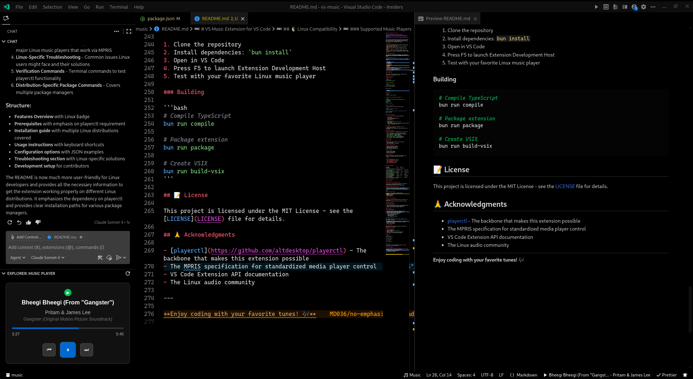
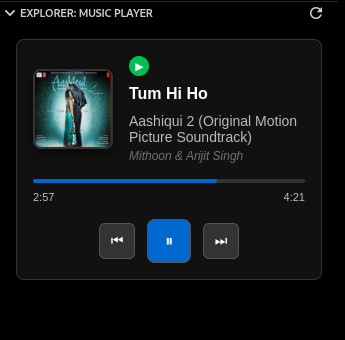

# VS Music Extension for VS Code


[](https://wakatime.com/badge/user/c8cd0c53-219b-4950-8025-0e666e97e8c8/project/a68f0e8f-e56d-4815-8c99-1e6c2d6a27c8)

> **🎵 Code in Flow.**
> A Visual Studio Code extension that displays currently playing music information and provides playback controls directly in your editor.

---

## 🚀 What is VS Music?

VS Music integrates your system's media controls directly into the VS Code status bar. It’s designed for developers who want to skip track, pause, or see what's playing without ever leaving their code editor.

**✨ NEW IN v0.2.1: Full Windows Support!**
Now compatible with Windows 10/11 using native System Media Transport Controls.

### Key Features
* **Universal Widget:** Shows song title, artist, and playback status.
* **Media Controls:** Play, Pause, Next, and Previous directly from the UI.
* **Cross-Platform:** Seamless experience on both **Windows** and **Linux**.
* **Zero-Config (Windows):** Automatically detects your active media player.

> **🚧 Roadmap:** We are currently working on a direct D-Bus integration for Linux to further improve performance in the next release.

---

## 📸 Screenshots



_The extension showing current track information in the status bar and media panel._

---

## 📦 Installation

### 🪟 Windows Users
**No additional software required!**
The extension includes a lightweight helper utility that automatically communicates with Windows media services (Spotify, Chrome, System Media, etc.).
1.  Install via VS Code Marketplace.
2.  Start playing music.
3.  Enjoy!

### 🐧 Linux Users
> **🚨 Critical Requirement:** You **MUST** have `playerctl` installed for this extension to work.

**1. Install playerctl**

| Distro | Command |
| :--- | :--- |
| **Ubuntu/Debian** | `sudo apt install playerctl` |
| **Fedora/RHEL** | `sudo dnf install playerctl` |
| **Arch Linux** | `sudo pacman -S playerctl` |
| **openSUSE** | `sudo zypper install playerctl` |

**2. Verify Installation**
Run this in your terminal to ensure it detects your player:
```bash
playerctl status

```

---

## 🔧 Troubleshooting

### 💡 Common Fixes (Read First!)

* **Linux:** 90% of issues are solved by installing `playerctl` and restarting VS Code.
* **Windows:** Ensure your music player (Spotify/Browser) is actually playing audio. Windows puts inactive players to "sleep" to save resources.

### 🪟 Windows Specific

* **Extension doesn't detect music:**
* Make sure the song is playing.
* Check if you can see the music in your Windows Notification Center / Lock Screen. If Windows can't see it, neither can we!
* **Browser Users:** Ensure "Hardware Media Key Handling" is enabled in your browser settings.


### 🐧 Linux Specific

* **"playerctl not available" error:**
* Run `playerctl --version` in your terminal. If this command fails, the extension will not work.


* **Artwork not loading:**
* The extension caches artwork (limit 100MB/200 images) to prevent bloat.
* Supported formats: PNG, JPEG, WebP.
* Try restarting VS Code to clear the cache.


---

## ⚙️ Technical Details

This extension uses a platform-agnostic architecture to ensure speed and stability:

* **Windows:** Uses a custom C# helper (`QuazaarMedia.exe`) to interface with `Windows.Media.Control.GlobalSystemMediaTransportControlsSessionManager`.
* **Linux:** Wraps `playerctl` commands to interface with MPRIS-compatible players.
* **Performance:** Implements intelligent caching and exponential backoff strategies to ensure VS Code remains lightweight.

---

## 👨‍💻 Author & Connect

**Swapnil Ingle** ([@codershubinc](https://github.com/codershubinc))

### 📬 Project Links

* **[Report a Bug](https://github.com/codershubinc/vs-music/issues)**
* **[View Source Code](https://github.com/codershubinc/vs-music)**
* **[VS Code Marketplace](https://marketplace.visualstudio.com/items?itemName=codershubinc.music)**

---

### Enjoy coding with your favorite tunes! 🎶 
