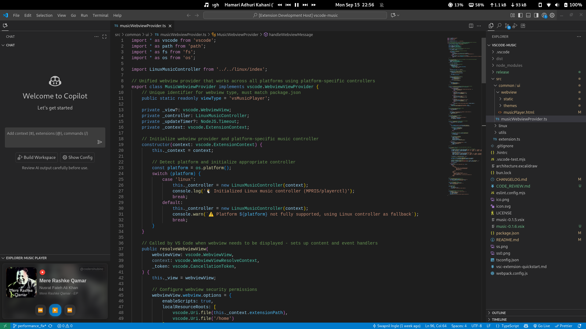
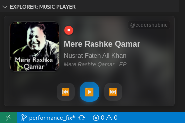

# VS Music Extension for VS Code


A Visual Studio Code extension that displays currently playing music information and provides playback controls directly in your editor. Perfect for Linux developers who want to stay in their coding flow while managing their music.

## 📸 Screenshots




_The extension showing current track information in VS Code with the music player panel and status bar integration_

## ✨ Features

- **Status Bar Integration**: Shows current track info (title, artist) in VS Code's status bar
- **Music Explorer Panel**: Dedicated panel in the Explorer sidebar with music controls
- **Playback Controls**: Play/pause, next/previous track controls
- **Real-time Updates**: Automatically updates when tracks change
- **Corner Widget**: Optional floating widget for quick access
- **Configurable Display**: Customize what information is shown and where

## 🐧 Linux Compatibility :: ( we are adding for win and mac shortly)

This extension is specifically designed for Linux systems and uses `playerctl` to communicate with MPRIS-compatible media players.

### Supported Music Players

The following Linux music players are supported through MPRIS/playerctl:

- **Spotify**
- **VLC Media Player**
- **Rhythmbox**
- **Audacious**
- **Clementine**
- **Strawberry**
- **Amarok**
- **Banshee**
- **Totem**
- **mpv** (with MPRIS script)
- **Chromium/Chrome** (when playing media)
- **Firefox** (when playing media)
- And any other MPRIS-compatible player

## 📦 Installation

### Prerequisites

**Important**: You must have `playerctl` installed on your Linux system for this extension to work.

#### Install playerctl

**Ubuntu/Debian:**

```bash
sudo apt update
sudo apt install playerctl
```

**Fedora/CentOS/RHEL:**

```bash
sudo dnf install playerctl
# or for older versions:
sudo yum install playerctl
```

**Arch Linux:**

```bash
sudo pacman -S playerctl
```

**openSUSE:**

```bash
sudo zypper install playerctl
```

**From Source (if not available in repos):**

```bash
git clone https://github.com/altdesktop/playerctl.git
cd playerctl
meson builddir
cd builddir
ninja
sudo ninja install
```

### Verify Installation

Test that playerctl works with your music player:

```bash
# Check if playerctl is installed
playerctl --version

# Test with your music player (start playing music first)
playerctl metadata
playerctl status
```

### Install the Extension

1. **From VS Code Marketplace**:

   - Open VS Code
   - Go to Extensions (Ctrl+Shift+X)
   - Search for "VS Music" by **codershubinc**
   - Click Install

2. **From VSIX file**:

   - Download the `music-0.0.1.vsix` file from [releases](https://github.com/codershubinc/vscode-music/releases)
   - Open VS Code
   - Press Ctrl+Shift+P and type "Extensions: Install from VSIX"
   - Select the downloaded .vsix file

3. **From GitHub**:
   - Visit the [VS Music repository](https://github.com/codershubinc/vscode-music)
   - Download the latest release

## 🚀 Usage

1. **Start your music player** (Spotify, VLC, etc.)
2. **Begin playing music**
3. The extension will automatically detect and display track information

### Available Commands

Access these commands via the Command Palette (Ctrl+Shift+P):

- `Music: Toggle Widget` - Show/hide the music widget
- `Music: Toggle Corner Widget` - Show/hide corner widget
- `Music: Play/Pause` - Toggle playback
- `Music: Next Track` - Skip to next track
- `Music: Previous Track` - Go to previous track
- `Music: Show Music Panel` - Open the music panel
- `Music: Refresh` - Refresh music information

### UI Components

#### Status Bar

- Shows current track information in the status bar
- Click to play/pause
- Configurable position (left/right)

#### Music Explorer Panel

- Located in the Explorer sidebar
- Shows detailed track information
- Includes playback controls
- Shows album art (when available)

#### Corner Widget

- Optional floating widget
- Quick access to controls
- Minimal and unobtrusive

## ⚙️ Configuration

Configure the extension through VS Code settings (File → Preferences → Settings, then search for "music"):

```json
{
  "music.enableStatusBar": true,
  "music.statusBarPosition": "right",
  "music.statusBarPriority": 100,
  "music.updateInterval": 1000,
  "music.showAlbumArt": true,
  "music.maxTitleLength": 30
}
```

### Settings Reference

| Setting                   | Type    | Default   | Description                                    |
| ------------------------- | ------- | --------- | ---------------------------------------------- |
| `music.enableStatusBar`   | boolean | `true`    | Show music info in status bar                  |
| `music.statusBarPosition` | string  | `"right"` | Position of music info (`"left"` or `"right"`) |
| `music.statusBarPriority` | number  | `100`     | Priority of music status bar item              |
| `music.updateInterval`    | number  | `1000`    | Update interval in milliseconds                |
| `music.showAlbumArt`      | boolean | `true`    | Show album art in music panel                  |
| `music.maxTitleLength`    | number  | `30`      | Maximum length of song title in status bar     |

## 🔧 Troubleshooting

### Common Issues

#### "playerctl not available" message

- **Solution**: Install playerctl using your distribution's package manager (see Installation section)
- **Verify**: Run `playerctl --version` in terminal

#### Extension doesn't detect music

- **Check**: Ensure your music player supports MPRIS
- **Test**: Run `playerctl metadata` while music is playing
- **Restart**: Try restarting VS Code after starting your music player

#### No controls working

- **Verify**: Test playerctl commands manually:
  ```bash
  playerctl play-pause
  playerctl next
  playerctl previous
  ```

#### Track info not updating

- **Check**: Increase the update interval in settings if on a slower system
- **Restart**: Restart both your music player and VS Code

### Debug Information

To get debug information:

1. Open VS Code Developer Tools (Help → Toggle Developer Tools)
2. Check the Console tab for VS Music extension logs
3. Look for error messages related to playerctl

### Getting Help

If you encounter issues:

1. Check that playerctl works with your music player
2. Verify your music player supports MPRIS
3. Check VS Code's Developer Console for errors
4. Create an issue with your system info:
   - Linux distribution and version
   - Music player and version
   - playerctl version
   - Error messages from console

## 🎵 Supported Formats

The extension works with any audio format supported by your music player, including:

- MP3, FLAC, OGG, AAC, WAV
- Streaming services (Spotify, YouTube Music in browser)
- Internet radio streams
- Podcasts and audiobooks

## 🤝 Contributing

Contributions are welcome! This extension is specifically designed for Linux systems.

### Development Setup

1. Clone the repository: `git clone https://github.com/codershubinc/vscode-music.git`
2. Navigate to music directory: `cd vscode-music/music`
3. Install dependencies: `bun install`
4. Open in VS Code
5. Press F5 to launch Extension Development Host
6. Test with your favorite Linux music player

### Building

```bash
# Compile TypeScript
bun run compile

# Package extension
bun run package

# Create VSIX
bun run build-vsix
```

## 👨‍💻 Author

**Swapnil Ingle** ([@codershubinc](https://github.com/codershubinc))

- Publisher: `codershubinc`
- GitHub: <https://github.com/codershubinc/vscode-music>
- Issues: <https://github.com/codershubinc/vscode-music/issues>

## 📈 Marketplace Information

- **Extension Name**: VS Music
- **Publisher**: codershubinc
- **Version**: 0.0.1
- **Category**: Other
- **License**: MIT
- **Engine**: VS Code ^1.103.0

## 🏷️ Keywords

`music`, `player`, `spotify`, `vlc`, `linux`, `playerctl`, `mpris`, `status-bar`, `media-control`, `audio`, `playback`, `music-info`

## 📝 License

This project is licensed under the MIT License - see the [LICENSE](LICENSE) file for details.

## 🙏 Acknowledgments

- [playerctl](https://github.com/altdesktop/playerctl) - The backbone that makes this extension possible
- The MPRIS specification for standardized media player control
- VS Code Extension API documentation
- The Linux audio community

---

### Enjoy coding with your favorite tunes! 🎶
